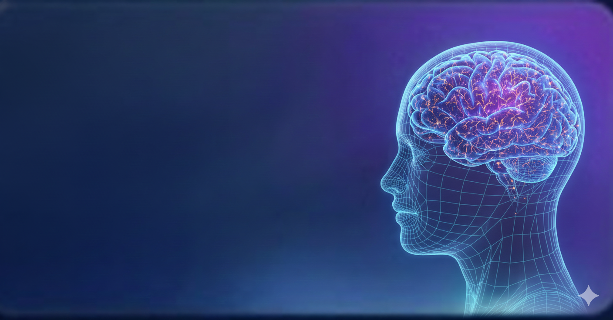

# NeuroScan - AI-Powered Brain Tumor Detection

 

## Overview

NeuroScan is an advanced Android application designed to provide accessible and rapid AI-powered analysis of brain MRI scans. By leveraging a custom-trained TensorFlow Lite model, the app can detect the presence of brain tumors from user-uploaded images, offering a crucial first step in early detection.

This project is built with a modern, dark-themed UI and integrates Firebase for a complete user authentication and data management experience.

---

## Key Features

*   **User Authentication**: Secure user registration and login functionality using Firebase Authentication, complete with email verification.
*   **Personalized Dashboard**: A modern, intuitive home screen that greets the user by name and provides quick access to all major features.
*   **AI-Powered Scanning**: Users can upload MRI images from their gallery or capture them directly with their camera. The integrated TensorFlow Lite model analyzes the image to detect brain tumors and displays the results with a confidence score.
*   **Profile Management**: Users can create and manage their profiles, including their name, date of birth, country, and a profile picture. All data is securely stored in Firebase.
*   **Image Management**: Profile pictures are uploaded to Firebase Storage, ensuring efficient and scalable image handling.
*   **Modern UI/UX**: The app is designed with a clean, dark-themed, and user-friendly interface, using Material Design components for a consistent and professional look.

---

## Technical Stack

*   **Language**: [Kotlin](https://kotlinlang.org/)
*   **UI Toolkit**: Android Jetpack with Material Design 3
*   **Architecture**: View Binding for safe and efficient view access.
*   **Machine Learning**: [TensorFlow Lite](https://www.tensorflow.org/lite) for on-device model inference.
*   **Backend Services (Firebase)**:
    *   [Firebase Authentication](https://firebase.google.com/docs/auth) for user management.
    *   [Firebase Realtime Database](https://firebase.google.com/docs/database) for storing user profile data.
    *   [Firebase Storage](https://firebase.google.com/docs/storage) for hosting user-uploaded profile pictures.
*   **Image Loading**: [Glide](https://github.com/bumptech/glide) for efficient loading and caching of profile images.
*   **Asynchronous Programming**: Kotlin Coroutines for managing background tasks like model loading and image analysis.

---

## Getting Started

To get a local copy up and running, follow these simple steps.

### Prerequisites

*   Android Studio (latest version recommended)
*   A Firebase project set up with Authentication, Realtime Database, and Storage enabled.

### Installation

1.  **Clone the repo**
    ```sh
    git clone https://github.com/shahyanahmedkiani/NeuroScan.git
    ```
2.  **Set up Firebase**
    *   Download your `google-services.json` file from your Firebase project settings.
    *   Place the `google-services.json` file in the `app/` directory of the project.
3.  **Add Your Model**
    *   Place your trained TensorFlow Lite model file (named `model.tflite`) into the `app/src/main/assets/` directory. If the `assets` folder does not exist, you will need to create it.
4.  **Sync and Run**
    *   Open the project in Android Studio, sync the Gradle files, and run the app on an emulator or a physical device.

---

## Disclaimer

This application is intended for educational and supportive purposes only. It is **not a substitute** for professional medical advice, diagnosis, or treatment. Always seek the advice of your physician or other qualified health provider with any questions you may have regarding a medical condition.
